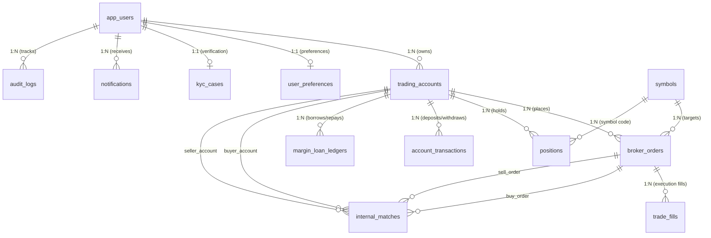

# 🗺️ תוכנית עבודה מקיפה: מיגרציה לסכמה רלציונית מלאה ב-Convex
## Comprehensive Migration & Architecture Plan: UI_alfa to Convex

מסמך זה מהווה תוכנית אדריכלית שלמה, שלב-אחר-שלב, להעברת המודל הנתונים הרלציוני של מערכת המסחר והברוקר (`UI_alfa` - PostgreSQL / Spring Boot) אל פלטפורמת **Convex**.

---

## 1. מבוא ועקרונות יסוד: Relational Data ב-Convex

Convex הינו מסד נתונים ריאקטיבי (Reactive Document-Relational Database). למרות שהוא שומר מסמכים (JSON-like documents), הוא תומך באופן טבעי ומובנה בקשרים רלציוניים (Relational Data Models):

1. **Foreign Keys מובנים באמצעות `v.id("table")`**:
   במקום מזהים מספריים שרירותיים (`BIGINT`), כל רשומה מקבלת `_id` ייחודי ומאובטח. קשרים בין טבלאות מוגדרים באמצעות `v.id("target_table")`, מה שמבטיח Type-Safety מלא בזמן קומפילציה.
2. **אינדקסים מותאמים (Indexes)**:
   Convex אינו מבצע סריקות טבלה רחבות (Full Table Scans) בשאילתות ייצור. כל קשר רלציוני (למשל כל ההזמנות של חשבון מסוים) מקבל אינדקס ייעודי (`.index("by_account", ["tradingAccountId"])`).
3. **פעולות טרנזקציוניות אטומיות (ACID Mutations)**:
   כל Mutation ב-Convex מבוצעת באופן אטומי וסריאלי (Serial ACID). אם פקודת מסחר פותחת פוזיציה, מעדכנת יתרה ומייצרת טרנזקציה – הכל מתבצע באותה טרנזקציה מובטחת ללא צורך במנעולים מורכבים.
4. **ריאקטיביות מובנית ל-UI (Zero-Latency Subscriptions)**:
   אין צורך ב-Polling או ב-WebSockets ייעודיים – כל רכיב React שמשתמש ב-`useQuery` מתעדכן ב-Real-Time ברגע שפוזיציה נסגרת או שפקודה מקבלת Match.

---

## 2. מיפוי הטבלאות והקשרים (ERD Mapping)

להלן מיפוי הישויות הקיימות ממסד הנתונים PostgreSQL של המערכת אל Convex:



---

## 3. הגדרת הסכמה הרלציונית המלאה ב-Convex (`convex/schema.ts`)

קובץ זה מגדיר את כל 13 הטבלאות, השדות, הטיפוסים והאינדקסים הדרושים לשאילתות מהירות:

```typescript
// convex/schema.ts
import { defineSchema, defineTable } from "convex/server";
import { v } from "convex/values";

export default defineSchema({
  // 1. משתמשי המערכת
  appUsers: defineTable({
    email: v.string(),
    displayName: v.string(),
    passwordHash: v.string(),
    role: v.union(v.literal("ADMIN"), v.literal("USER")),
    banned: v.boolean(),
    bannedAt: v.optional(v.string()),
    bannedReason: v.optional(v.string()),
    isSimulated: v.boolean(), // עבור חשבונות Netting ממוחשבים (sim-lp-1/2)
    createdAt: v.number(),   // UTC Timestamp ms
  })
    .index("by_email", ["email"])
    .index("by_role", ["role"]),

  // 2. העדפות משתמש (1:1 מול appUsers)
  userPreferences: defineTable({
    userId: v.id("appUsers"),
    theme: v.optional(v.string()),          // 'dark' | 'light'
    preferredColor: v.optional(v.string()), // שמירת צבע מועדף ב-DB
    language: v.optional(v.string()),       // 'he' | 'en' | 'ru'
    updatedAt: v.number(),
  }).index("by_user", ["userId"]),

  // 3. חשבונות מסחר (1:N מול appUsers)
  tradingAccounts: defineTable({
    userId: v.id("appUsers"),
    accountType: v.union(v.literal("DEMO"), v.literal("REAL")),
    currency: v.string(), // 'USD', 'EUR', etc.
    leverage: v.number(), // e.g. 100
    status: v.union(v.literal("ACTIVE"), v.literal("DISABLED"), v.literal("MARGIN_CALL")),
    balance: v.number(),
    equity: v.number(),
    marginUsed: v.number(),
    freeMargin: v.number(),
    borrowedBalance: v.number(),        // יתרת הלוואת Margin
    creditLimit: v.number(),            // מסגרת אשראי
    dailyInterestRate: v.number(),      // ריבית יומית (e.g. 0.005 = 0.5%)
    interestAccruedTotal: v.number(),   // סך ריבית שנצברה
    commissionPaidTotal: v.number(),    // סך עמלות ששולמו
    lastInterestAt: v.optional(v.number()),
    isSimulated: v.boolean(),
    createdAt: v.number(),
    updatedAt: v.number(),
  })
    .index("by_user", ["userId"])
    .index("by_status", ["status"]),

  // 4. נכסים וסמלי מסחר
  symbols: defineTable({
    code: v.string(), // e.g. 'BTCUSDT', 'EURUSD'
    kind: v.union(v.literal("CRYPTO"), v.literal("FX"), v.literal("STOCK"), v.literal("COMMODITY")),
    baseCurrency: v.string(),
    quoteCurrency: v.string(),
    priceDecimals: v.number(),
    enabled: v.boolean(),
    minOrderQty: v.optional(v.number()),
    maxOrderQty: v.optional(v.number()),
  })
    .index("by_code", ["code"])
    .index("by_kind_enabled", ["kind", "enabled"]),

  // 5. פקודות מסחר (Broker Orders)
  brokerOrders: defineTable({
    tradingAccountId: v.id("tradingAccounts"),
    symbolCode: v.string(),
    side: v.union(v.literal("BUY"), v.literal("SELL")),
    orderType: v.union(v.literal("MARKET"), v.literal("LIMIT"), v.literal("STOP"), v.literal("STOP_LIMIT")),
    status: v.union(
      v.literal("NEW"),
      v.literal("PARTIALLY_FILLED"),
      v.literal("FILLED"),
      v.literal("CANCELED"),
      v.literal("REJECTED"),
      v.literal("PENDING_NET")
    ),
    quantity: v.number(),
    filledQty: v.number(),
    internalQty: v.number(),      // כמות שבוצעה ב-Netting פנימי
    externalQty: v.number(),      // כמות שנשלחה לשוק חיצוני (LP / MT5)
    reserveRemaining: v.optional(v.number()),
    limitPrice: v.optional(v.number()),
    stopPrice: v.optional(v.number()),
    takeProfit: v.optional(v.number()),
    stopLoss: v.optional(v.number()),
    entryPrice: v.optional(v.number()),
    realizedPnl: v.optional(v.number()),
    routing: v.optional(v.string()), // 'INTERNAL', 'EXTERNAL', 'HYBRID', 'LEGACY'
    netDeadline: v.optional(v.number()),
    nnShadowCorrect: v.optional(v.boolean()),
    clientTag: v.optional(v.string()),
    createdAt: v.number(),
    updatedAt: v.number(),
    filledAt: v.optional(v.number()),
  })
    .index("by_account", ["tradingAccountId"])
    .index("by_account_created", ["tradingAccountId", "createdAt"])
    .index("by_symbol_side_status", ["symbolCode", "side", "status"])
    .index("by_status", ["status"]),

  // 6. ביצועי פקודות (Fills)
  tradeFills: defineTable({
    orderId: v.id("brokerOrders"),
    price: v.number(),
    quantity: v.number(),
    fee: v.number(),
    liquidity: v.optional(v.union(v.literal("MAKER"), v.literal("TAKER"), v.literal("INTERNAL"))),
    executedAt: v.number(),
  }).index("by_order", ["orderId"]),

  // 7. פוזיציות פתוחות וסגורות
  positions: defineTable({
    tradingAccountId: v.id("tradingAccounts"),
    symbolCode: v.string(),
    side: v.union(v.literal("BUY"), v.literal("SELL")),
    quantity: v.number(),
    avgPrice: v.number(),
    currentPrice: v.optional(v.number()),
    realizedPnl: v.number(),
    unrealizedPnl: v.number(),
    takeProfit: v.optional(v.number()),
    stopLoss: v.optional(v.number()),
    openedAt: v.number(),
    updatedAt: v.number(),
    closedAt: v.optional(v.number()), // תמיכה בהיסטוריית פוזיציות סגורות אמיתית
    status: v.union(v.literal("OPEN"), v.literal("CLOSED")),
  })
    .index("by_account", ["tradingAccountId"])
    .index("by_account_status", ["tradingAccountId", "status"])
    .index("by_account_symbol", ["tradingAccountId", "symbolCode"]),

  // 8. תנועות חשבון (הפקדות/משיכות/זיכויים)
  accountTransactions: defineTable({
    tradingAccountId: v.id("tradingAccounts"),
    txType: v.union(v.literal("DEPOSIT"), v.literal("WITHDRAWAL"), v.literal("ADJUSTMENT"), v.literal("BONUS")),
    status: v.union(v.literal("PENDING"), v.literal("APPROVED"), v.literal("REJECTED")),
    amount: v.number(),
    currency: v.string(),
    method: v.optional(v.string()), // 'internal', 'crypto', 'card', 'bank'
    note: v.optional(v.string()),
    createdAt: v.number(),
    processedAt: v.optional(v.number()),
  }).index("by_account_created", ["tradingAccountId", "createdAt"]),

  // 9. ספר פקודות והתאמות Netting פנימי (Internal Match)
  internalMatches: defineTable({
    symbolCode: v.string(),
    buyOrderId: v.id("brokerOrders"),
    sellOrderId: v.id("brokerOrders"),
    buyAccountId: v.id("tradingAccounts"),
    sellAccountId: v.id("tradingAccounts"),
    quantity: v.number(),
    bid: v.number(),
    mid: v.number(),
    ask: v.number(),
    buyerImprovement: v.number(),
    sellerImprovement: v.number(),
    externalFeeSaved: v.number(),
    buyerSimulated: v.boolean(),
    sellerSimulated: v.boolean(),
    createdAt: v.number(),
  })
    .index("by_symbol_created", ["symbolCode", "createdAt"])
    .index("by_buy_account", ["buyAccountId"])
    .index("by_sell_account", ["sellAccountId"]),

  // 10. ספר הלוואות מרג'ין (Margin Ledger)
  marginLoanLedger: defineTable({
    tradingAccountId: v.id("tradingAccounts"),
    entryType: v.union(
      v.literal("BORROW"),
      v.literal("REPAY"),
      v.literal("INTEREST"),
      v.literal("LIQUIDATION")
    ),
    amount: v.number(),
    borrowedAfter: v.number(),
    balanceAfter: v.number(),
    note: v.optional(v.string()),
    createdAt: v.number(),
  }).index("by_account_created", ["tradingAccountId", "createdAt"]),

  // 11. התראות מערכת
  notifications: defineTable({
    userId: v.id("appUsers"),
    notifType: v.string(), // 'TRADE', 'PRICE_ALERT', 'SYSTEM', 'MARGIN_CALL'
    title: v.string(),
    body: v.string(),
    readAt: v.optional(v.number()),
    createdAt: v.number(),
  }).index("by_user_created", ["userId", "createdAt"]),

  // 12. תיקי אימות ו-KYC
  kycCases: defineTable({
    userId: v.id("appUsers"),
    status: v.union(v.literal("NOT_STARTED"), v.literal("SUBMITTED"), v.literal("VERIFIED"), v.literal("REJECTED")),
    submittedAt: v.optional(v.number()),
    reviewedAt: v.optional(v.number()),
    note: v.optional(v.string()),
  }).index("by_user", ["userId"]),

  // 13. יומן ביקורת (Audit Log)
  auditLogs: defineTable({
    userId: v.optional(v.id("appUsers")),
    action: v.string(),
    detail: v.optional(v.string()),
    ip: v.optional(v.string()),
    userAgent: v.optional(v.string()),
    createdAt: v.number(),
  }).index("by_user_created", ["userId", "createdAt"]),
});
```

---

## 4. דפוסי מימוש רלציוניים (Relational Queries & Mutations)

ב-Convex אין תחביר `JOIN` של SQL. במקום זאת, מבוצע שימוש בדפוסים מודרניים של TypeScript:

### א. שליפת הורה עם כל ילדיו (Parent with Children - לדוגמה: חשבון עם פוזיציות ופקודות)
```typescript
// convex/accounts.ts
import { query } from "./_generated/server";
import { v } from "convex/values";

export const getAccountPortfolio = query({
  args: { accountId: v.id("tradingAccounts") },
  handler: async (ctx, args) => {
    // 1. קריאת החשבון
    const account = await ctx.db.get(args.accountId);
    if (!account) throw new Error("Account not found");

    // 2. שליפת פוזיציות פתוחות באמצעות אינדקס רלציוני
    const positions = await ctx.db
      .query("positions")
      .withIndex("by_account_status", (q) =>
        q.eq("tradingAccountId", args.accountId).eq("status", "OPEN")
      )
      .collect();

    // 3. שליפת 20 הפקודות האחרונות
    const recentOrders = await ctx.db
      .query("brokerOrders")
      .withIndex("by_account_created", (q) => q.eq("tradingAccountId", args.accountId))
      .order("desc")
      .take(20);

    return {
      account,
      positions,
      recentOrders,
    };
  },
});
```

### ב. פעולה אטומית רלציונית: סגירת פוזיציה ועדכון היסטוריה
כמענה לדרישה ב-`instructions.txt` ("במסך של הדשבורד של הפוזיציות הפתוחות שיהיה אופציה לסגור את הפוזיציות ולשמור בהיסטוריה באמת"):

```typescript
// convex/positions.ts
import { mutation } from "./_generated/server";
import { v } from "convex/values";

export const closePosition = mutation({
  args: {
    positionId: v.id("positions"),
    closingPrice: v.number(),
  },
  handler: async (ctx, args) => {
    const pos = await ctx.db.get(args.positionId);
    if (!pos || pos.status !== "OPEN") {
      throw new Error("Position is not open or does not exist");
    }

    const account = await ctx.db.get(pos.tradingAccountId);
    if (!account) throw new Error("Account not found");

    // חישוב PnL סופי
    const priceDelta = pos.side === "BUY" 
      ? args.closingPrice - pos.avgPrice 
      : pos.avgPrice - args.closingPrice;
    const finalRealizedPnl = priceDelta * pos.quantity;

    // 1. עדכון הפוזיציה ל-CLOSED ושמירת היסטוריה
    await ctx.db.patch(pos._id, {
      status: "CLOSED",
      realizedPnl: finalRealizedPnl,
      unrealizedPnl: 0,
      closedAt: Date.now(),
      updatedAt: Date.now(),
    });

    // 2. עדכון יתרת החשבון וה-Equity
    const newBalance = account.balance + finalRealizedPnl;
    await ctx.db.patch(account._id, {
      balance: newBalance,
      equity: newBalance,
      marginUsed: Math.max(0, account.marginUsed - (pos.quantity * pos.avgPrice) / account.leverage),
      updatedAt: Date.now(),
    });

    // 3. תיעוד תנועה בחשבון (Audit / Transaction Record)
    await ctx.db.insert("accountTransactions", {
      tradingAccountId: account._id,
      txType: "ADJUSTMENT",
      status: "APPROVED",
      amount: finalRealizedPnl,
      currency: account.currency,
      note: `Closed ${pos.side} ${pos.quantity} ${pos.symbolCode} @ ${args.closingPrice}`,
      createdAt: Date.now(),
      processedAt: Date.now(),
    });

    return { ok: true, realizedPnl: finalRealizedPnl };
  },
});
```

---

## 5. תוכנית ביצוע שלב-אחר-שלב (Migration Execution Steps)

### שלב 1: התקנת Convex בפרויקט ה-React
1. התקנת תלויות ה-Frontend:
   ```bash
   cd UI-react
   npm install convex
   ```
2. אתחול Convex (יצירת תיקיית `convex/` והתחברות לפרויקט):
   ```bash
   npx convex dev
   ```
3. שמירת קובץ הסכמה המלא ב-`UI-react/convex/schema.ts`.

### שלב 2: סקריפט ייצוא מ-PostgreSQL ויבוא ל-Convex
נבנה סקריפט Node.js שמייצא את כל טבלאות ה-Postgres לקובצי JSONL, ומייבא אותם דרך `npx convex import`:

1. **מיפוי מזהים (ID Translation Table)**:
   ב-PostgreSQL המזהים הם מספרים (1, 2, 3...). בעת היבוא ל-Convex, כל רשומה מקבלת `_id` מחרוזתי של Convex.
   הסקריפט יחזיק מילון מיפוי:
   ```typescript
   const idMap = {
     users: new Map<number, Id<"appUsers">>(),
     accounts: new Map<number, Id<"tradingAccounts">>(),
     orders: new Map<number, Id<"brokerOrders">>(),
   };
   ```
2. סדר היבוא הרלציוני:
   * **רמה 1:** `appUsers`, `symbols`
   * **רמה 2:** `userPreferences`, `kycCases`, `tradingAccounts`
   * **רמה 3:** `brokerOrders`, `positions`, `accountTransactions`, `marginLoanLedger`
   * **רמה 4:** `tradeFills`, `internalMatches`

### שלב 3: התממשקות ל-React (החלפת ה-Store הקיים)
* חיבור ה-`ConvexProvider` ב-`App.tsx`.
* החלפת קריאות ה-Polling וה-REST ב-Hooks ריאקטיביים:
  * `useQuery(api.positions.listOpen, { accountId })` בדשבורד הפוזיציות.
  * `useMutation(api.orders.createOrder)` בחלון המסחר.
  * `useMutation(api.positions.closePosition)` בכפתור סגירת פוזיציה.

### שלב 4: מנוע ה-Netting ב-Convex (Internal Cross Engine)
העברת אלגוריתם ה-Netting (`client vs client` ו-`client vs computer LP`) לתוך Convex Mutation:
* בדיקת פקודות נגדיות פתוחות באותו Symbol.
* חישוב מחיר אמצע (Mid-price) ושיפור מחיר.
* ביצוע סליקה פנימית בטרנזקציה אטומית אחת.

---

## 6. לוח זמנים מומלץ (Roadmap)

| שלב | משימה | תוצר |
|---|---|---|
| **יום 1** | הקמת סביבת Convex + פריסת `schema.ts` | סכמה מהודרת ופעילה בענן Convex |
| **יום 2** | סקריפט מיגרציה וטעינת נתוני ה-Seed | כל המשתמשים, החשבונות והנכסים קיימים ב-Convex |
| **יום 3** | מימוש פונקציות מסחר (CRUD + Close Position) | אפשרות לסגור פוזיציות ולראות היסטוריה ב-Real-time |
| **יום 4** | חיבור מסכי ה-React ל-Convex Hooks | ביטול ה-Polling הישן והפעלת ממשק ריאקטיבי חלק |
| **יום 5** | בדיקות קצה-לקצה ואימות התאמות Netting | מערכת מלאה, מהירה ורלציונית ללא שגיאות |

---
*קובץ זה נשמר בבסיס הפרויקט כ-`CONVEX_RELATIONAL_MIGRATION_PLAN.md`.*
